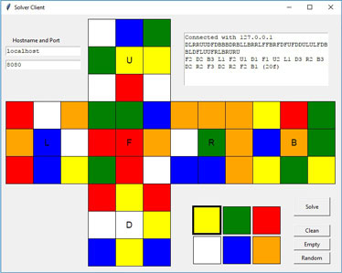

# RubiksCube-TwophaseSolver
## Overview 
This project implements the two-phase-algorithm in its fully developed form to solve Rubik's cube in Python. Though Python is much slower than for example C++ or even Java the implementation is sufficiently fast to solve random cubes in less than 20 moves on average on slow hardware like the Raspberry Pi3 within a few seconds.

If you just want to solve Rubik's cube and play around with its patterns [Cube Explorer](http://kociemba.org/cube.htm) may be the better choice. But if you want to get a better understanding of the two-phase-algorithm details, you work on a project to build a cube solving robot or you write software for an NxNxN cube and use the reduction method this may be the right place to look.

## Usage
There are several tables which must be created on the first run. These need about 80 MB disk space and it takes from about 1/2 to 6 hours to create them, depending on the hardware. Usually you start the cubesolving server which listens on a port of your choice and which accepts the cube definition string and returns the solving maneuver. The module example.py gives detailed examples how to start the server and a simple GUI-interface which interacts with the server. You can run the example file with

"python example.py" or eventually "python3 example.py"

Make sure that you use Python 3.4 or higher and you have the numpy package installed. 

If you run the script "computer_vision.py" you have the possibility to enter the facelet colors with a webcam. There are several parameters which have an influence on the facelet detection quality.  If you use a Raspberry Pi with the Raspberry Pi Camera Module  and not an USB-webcam make sure you do "sudo modprobe bcm2835-v4l2" first. 

You can find some more information how to set the parameters here:
[Computer vision and Rubik's cube](http://kociemba.org/computervision.html)
