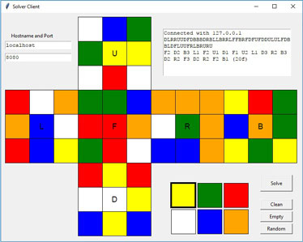

# RubiksCube-TwophaseSolver

## Overview

This project implements the fully developed version of the two-phase algorithm for solving the Rubik's Cube in Python. Although Python is much slower than languages such as C++ or Java, the implementation is efficient enough to solve random cubes in fewer than 20 moves on average within a few seconds, even on relatively slow hardware such as the Raspberry Pi 3.

If your goal is simply to solve the Rubik's Cube and explore its patterns, [Cube Explorer](http://kociemba.org/cube.htm) might be the better choice. However, if you aim to gain a deeper understanding of the intricacies of the two-phase algorithm, or if you are working on a project to build a cube-solving robot that produces near-optimal solutions, then this is the right resource.

## Usage

The package is available on PyPI and can be installed with

```bash
pip install RubikTwoPhase
```

Once installed, you can import the `twophase.solver` module into your code:

```python
>>> import twophase.solver as sv
```

Some tables need to be generated, but only during the first run. These tables occupy approximately 80 MB of disk space and may take half an hour or more to generate, depending on your hardware. However, it is precisely these computationally expensive tables that enable the algorithm to operate efficiently, usually finding near-optimal solutions.

A cube is represented by its cube definition string. The solved cube is represented by

```text
UUUUUUUUURRRRRRRRRFFFFFFFFFDDDDDDDDDLLLLLLLLLBBBBBBBBB
```

For example,

```python
>>> cubestring = 'DUUBULDBFRBFRRULLLBRDFFFBLURDBFDFDRFRULBLUFDURRBLBDUDL'
```

Refer to `enums.py` for the exact format of the cube definition string:

https://github.com/hkociemba/RubiksCube-TwophaseSolver/blob/master/enums.py

To solve the cube, call

```python
>>> sv.solve(cubestring, 19, 2)
```

This attempts to solve the cube described by the definition string with a desired maximum solution length of 19 moves and a timeout of 2 seconds. If the timeout is reached, the shortest solution found so far is returned, even if it exceeds the desired maximum length.

A typical result is

```text
L3 U1 B1 R2 F3 L1 F3 U2 L1 U3 B3 U2 B1 L2 F1 U2 R2 L2 B2 (19f)
```

Here, `U`, `R`, `F`, `D`, `L`, and `B` denote the Up, Right, Front, Down, Left, and Back faces of the cube. The suffixes `1`, `2`, and `3` denote clockwise rotations of 90°, 180°, and 270°, respectively.

If you prefer to allocate a fixed computation time `t` to each search and receive only the shortest solution found within that time, use

```python
>>> sv.solve(cubestring, 0, t)
```

You can test the performance of the algorithm on your machine with, for example,

```python
>>> import twophase.performance as pf
>>> pf.test(100, 0.3)
```

This example generates 100 random cubes, allows 0.3 seconds for each search, and displays statistics on the resulting solution lengths.

You can also solve a cube to an arbitrary target pattern rather than to the solved position. The target pattern is represented by the `goalstring`.

```python
>>> sv.solveto(cubestring, goalstring, 20, 0.1)
```

This allows, for example, 0.1 seconds to find a solution of at most 20 moves from `cubestring` to `goalstring`.

---

## Server

Another feature is the ability to start a local server listening on a port of your choice. It accepts a cube definition string and returns the corresponding solution.

```python
>>> import twophase.server as srv
>>> srv.start(8080, 20, 2)
```

Alternatively, you can start the server in the background:

```python
>>> import twophase.start_server as ss
>>> from threading import Thread
>>> bg = Thread(target=ss.start, args=(8080, 20, 2))
>>> bg.start()
```

Upon successful startup, messages similar to

```text
Server socket created
Server now listening...
```

indicate that the server is running correctly. In this example, the server listens on port `8080`, uses a desired maximum solution length of 20 moves, and a timeout of 2 seconds.

The server can also run on a remote machine and may be accessed in several ways.

Using a web browser on the same machine:

```text
http://localhost:8080/DUUBULDBFRBFRRULLLBRDFFFBLURDBFDFDRFRULBLUFDURRBLBDUDL
```

Using a web browser on a remote machine:

```text
http://myserver.com:8081/DUUBULDBFRBFRRULLLBRDFFFBLURDBFDFDRFRULBLUFDURRBLBDUDL
```

Here, the server is assumed to be running on `myserver.com` and listening on port `8081`.

Using Netcat (`nc`):

```bash
echo DUUBULDBFRBFRRULLLBRDFFFBLURDBFDFDRFRULBLUFDURRBLBDUDL | nc localhost 8080
```

You can also communicate with the server using a small graphical client that allows you to enter the cube definition string interactively:

```python
>>> import twophase.client_gui
```



---

## Experimental computer vision

Please note that the following module is experimental and requires the installation of the OpenCV package:

```bash
pip install opencv-python
```

It also requires the NumPy package:

```bash
pip install numpy
```

Load the module with

```python
>>> import twophase.computer_vision
```

Make sure that the server is running and that a webcam is connected to the client.

You can use the webcam to capture the facelet colors. Several parameters affect the quality of the facelet detection. If you are using a Raspberry Pi Camera Module instead of a USB webcam, first run

```bash
sudo modprobe bcm2835-v4l2
```

More information about configuring the parameters can be found here:

[Computer vision and Rubik's Cube](http://kociemba.org/computervision.html)

---

## Performance Metrics

The following tests were performed on a Windows 10 machine with an AMD Ryzen 7 3700X processor running at 3.59 GHz. We compared the standard CPython interpreter with PyPy (pypy3) using its just-in-time compiler. Depending on the available computation time, PyPy provides a speedup of approximately a factor of 10.

The function

```python
test(1000, t)
```

generates 1000 random cubes, allows `t` seconds of computation time for each cube, and reports the distribution of the resulting solution lengths.

#### Standard CPython

test(1000,30): {14: 0, 15: 2, 16: 12, 17: 74, 18: 279, 19: 534, 20: 99, 21: 0}, average 18.63 moves  
test(1000,10): {14: 0, 15: 1, 16: 8, 17: 51, 18: 242, 19: 532, 20: 166, 21: 0}, average 18.79 moves  
test(1000,1): {14: 0, 15: 2, 16: 4, 17: 28, 18: 127, 19: 401, 20: 405, 21: 33, 22: 0}, average 19.27 moves  
test(1000,0.1): {15: 0, 16: 2, 17: 6, 18: 46, 19: 186, 20: 451, 21: 293, 22: 16, 23: 0}, average 20.02 moves  
#### PyPy (pypy3) with just-in-time compiler

test(1000,10): {14: 0, 15: 1, 16: 11, 17: 100, 18: 423, 19: 433, 20: 32, 21: 0}, average 18.37 moves  
test(1000,1): {14: 0, 15: 1, 16: 10, 17: 49, 18: 259, 19: 535, 20: 145, 21: 1, 22: 0}, average 18.76 moves  
test(1000,0.1): {15: 0, 16: 4, 17: 23, 18: 100, 19: 429, 20: 401, 21: 43, 22: 0}, average 19.33 moves  
test(1000,0.01): {16: 0, 17: 1, 18: 25, 19: 95, 20: 349, 21: 461, 22: 69, 23: 0}, average 20.45 moves  

To achieve an average solution length below 19 moves, approximately 10 seconds per cube are sufficient with CPython, whereas only about 1 second is required with PyPy.

Allowing the average solution length to increase by about 0.5 moves reduces the required computation time to approximately 1 second with CPython and 0.1 seconds with PyPy.

## Star History

The chart below shows the growth in the popularity of the project over time.

[](https://star-history.com/#hkociemba/RubiksCube-TwophaseSolver&Date)

